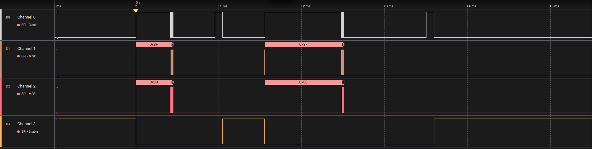
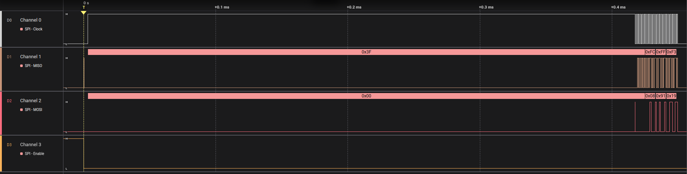
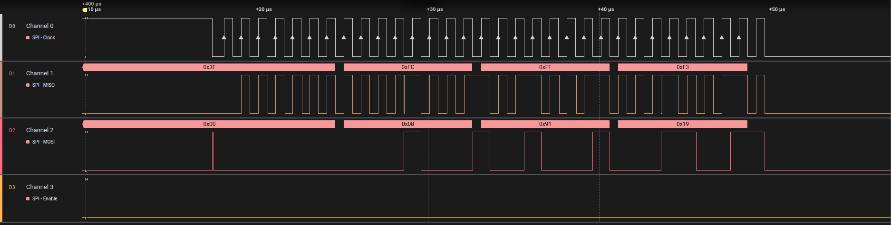
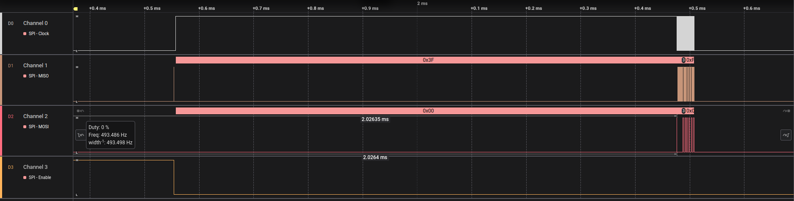
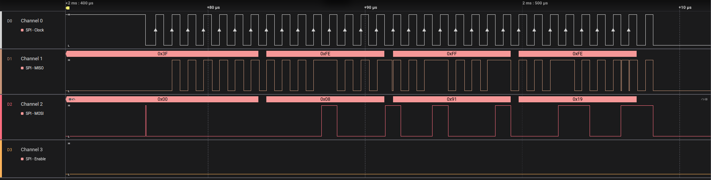

# Goal

This repository's purpose is to demonstrate in a small Proof-Of-Concept(POC) an issue related to the `embassy_stm32` HAL SPI's implementation.

# Content

A single rust crate used to flash a STM NUCLEO-F439ZI (STM32F439ZIT6U) with the SPI3 peripheral connected to a logic analyzer or oscilloscope.
A Nix Shell is provided for quick setup and use.

# Issue

The issue that is demonstrated with this repository is a clock timing issue when using the `write` and  `transfer` function of the `embassy_stm32` spi driver. 

When starting a transaction the SPI correctly sets the CS low (in the example managed using the `embasssy-hal-bus` but the issue can also be reproduce while manually controlling the CS), however the clock doesn't work correctly for a while and triggers only once before staying high for several hundreds of microseconds then the actual expected behavior of a SPI transactions will happen before having the clock go low and wait for another several hundreds of second before the CS goes high again.

## Related logic analyzer output

1 iteration of the main code loop

First write

Second part of first write

Transfer

Second part of transfer

## Notes
The issue seems odly familiar to https://github.com/embassy-rs/embassy/issues/1094
